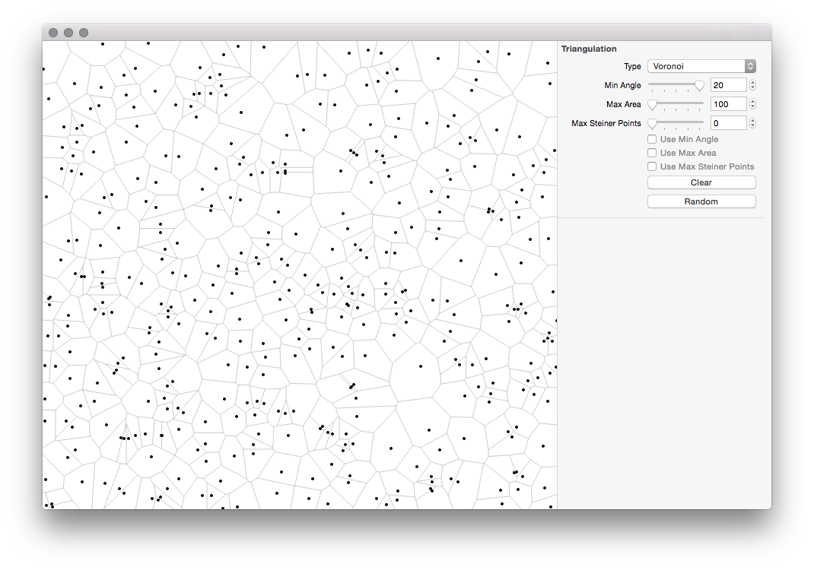
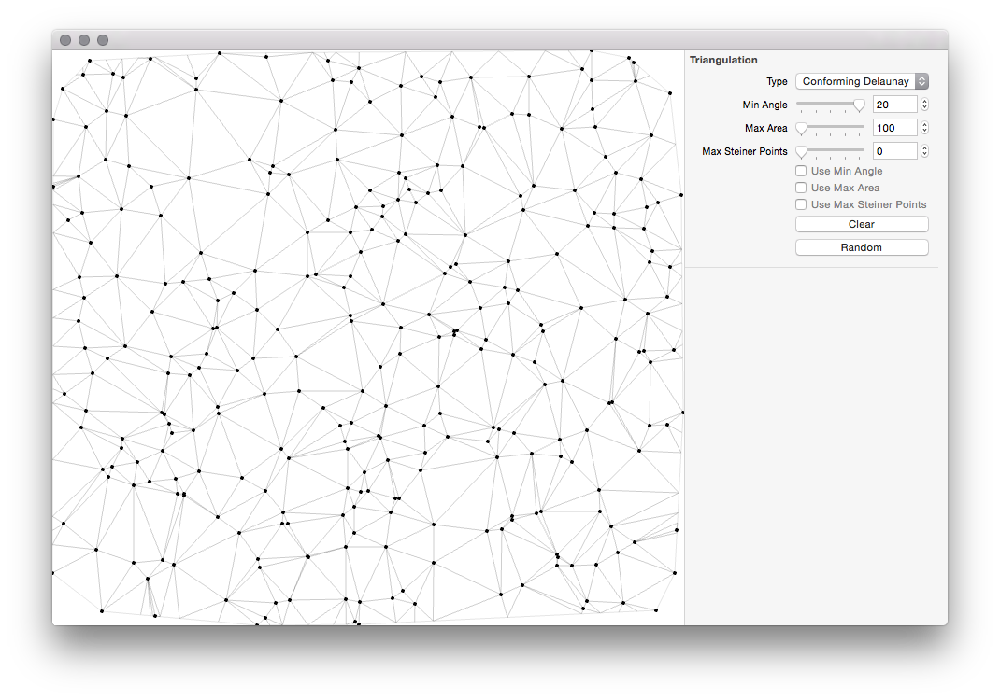

Triangulation
=============

A C++ library to generate Delaunay and Voronoi triangulations




## Classes

- [`takram::triangulation::Triangulator`](src/takram/triangulation/triangulator.h)
- [`takram::triangulation::DelaunayTriangulator`](src/takram/triangulation/delaunay_triangulator.h)
- [`takram::triangulation::VoronoiTriangulator`](src/takram/triangulation/voronoi_triangulator.h)

## Example

The following code outputs Voronoi lines and Delaunay triangles for randomly generated points.

```cc
#include <cstdlib>
#include <ostream>
#include <random>
#include <vector>

#include "takram/triangulation.h"

namespace {

struct Point {
  double x;
  double y;
};

}  // namespace

int main() {
  std::random_device random_device;
  std::default_random_engine engine(random_device());
  std::uniform_real_distribution<> distribution(0.0, 1.0);
  std::vector<Point> points(10);
  for (auto& point : points) {
    point.x = distribution(engine);
    point.y = distribution(engine);
  }
  takram::VoronoiTriangulator voronoi;
  if (voronoi(points)) {
    for (const auto& line : voronoi) {
      std::cout << line << std::endl;
    }
  }
  takram::DelaunayTriangulator delaunay;
  if (delaunay(points)) {
    for (const auto& triangle : delaunay) {
      std::cout << triangle << std::endl;
    }
  }
  return EXIT_SUCCESS;
}
```

## Parameters

- *type* (Delaunay triangulation only)
    - `takram::DelaunayTriangulator::Type::DEFAULT`
        - Will generate a [Delaunay triangulation](http://www.cs.cmu.edu/~quake/triangle.defs.html#dt).
        - Equivalent to specifying neither [-p](http://www.cs.cmu.edu/~quake/triangle.p.html) nor [-D](http://www.cs.cmu.edu/~quake/triangle.switch.html) command line switch of Triangle library.
    - `takram::DelaunayTriangulator::Type::CONSTRAINED`
        - Will generate a [constrained Delaunay triangulation](http://www.cs.cmu.edu/~quake/triangle.defs.html#cdt).
        - Equivalent to the [-p](http://www.cs.cmu.edu/~quake/triangle.p.html) command line switch of Triangle library.
    - `takram::DelaunayTriangulator::Type::CONFORMING`
        - Will generate a [conforming Delaunay triangulation](http://www.cs.cmu.edu/~quake/triangle.defs.html#conform).
        - Equivalent to the [-D](http://www.cs.cmu.edu/~quake/triangle.switch.html) command line switch of Triangle library.
    - `takram::DelaunayTriangulator::Type::CONSTRAINED_CONFORMING`
        - Will generate a [constrained conforming Delaunay triangulation](http://www.cs.cmu.edu/~quake/triangle.defs.html#ccdt).
        - Equivalent to specifying both [-p](http://www.cs.cmu.edu/~quake/triangle.p.html) and [-D](http://www.cs.cmu.edu/~quake/triangle.switch.html) command line switch of Triangle library.
- *min_angle*
    - Quality mesh generation with no angles smaller than 20 degrees.
    - Equivalent to the [-q](http://www.cs.cmu.edu/~quake/triangle.q.html) command line switch of Triangle library.
- *max_area*
    - Imposes a maximum triangle area constraint.
    - Equivalent to the [-a](http://www.cs.cmu.edu/~quake/triangle.a.html) command line switch of Triangle library.
- *max_steiner_points*
    - Specifies the maximum number of added [Steiner points](http://www.cs.cmu.edu/~quake/triangle.defs.html#steiner).
    - Equivalent to the [-S](http://www.cs.cmu.edu/~quake/triangle.S.html) command line switch of Triangle library.

## Setup Guide

Run "setup.sh" inside "script" directory to initialize submodules and build dependant libraries.

### Dependencies

- [Math](https://github.com/takram-design-engineering/takram-math)

### Submodules

- [Google Testing Framework](https://chromium.googlesource.com/external/googletest)

## License

The MIT License

Copyright (C) 2014-2015 Shota Matsuda

Permission is hereby granted, free of charge, to any person obtaining a copy
of this software and associated documentation files (the "Software"), to deal
in the Software without restriction, including without limitation the rights
to use, copy, modify, merge, publish, distribute, sublicense, and/or sell
copies of the Software, and to permit persons to whom the Software is
furnished to do so, subject to the following conditions:

The above copyright notice and this permission notice shall be included in
all copies or substantial portions of the Software.

THE SOFTWARE IS PROVIDED "AS IS", WITHOUT WARRANTY OF ANY KIND, EXPRESS OR
IMPLIED, INCLUDING BUT NOT LIMITED TO THE WARRANTIES OF MERCHANTABILITY,
FITNESS FOR A PARTICULAR PURPOSE AND NONINFRINGEMENT. IN NO EVENT SHALL THE
AUTHORS OR COPYRIGHT HOLDERS BE LIABLE FOR ANY CLAIM, DAMAGES OR OTHER
LIABILITY, WHETHER IN AN ACTION OF CONTRACT, TORT OR OTHERWISE, ARISING FROM,
OUT OF OR IN CONNECTION WITH THE SOFTWARE OR THE USE OR OTHER DEALINGS IN
THE SOFTWARE.

---

Triangle<br>
A Two-Dimensional Quality Mesh Generator and Delaunay Triangulator.<br>
Version 1.6

Copyright 1993, 1995, 1997, 1998, 2002, 2005 Jonathan Richard Shewchuk<br>
2360 Woolsey #H<br>
Berkeley, California  94705-1927<br>
jrs@cs.berkeley.edu

These programs may be freely redistributed under the condition that the
copyright notices (including the copy of this notice in the code comments
and the copyright notice printed when the `-h' switch is selected) are
not removed, and no compensation is received. Private, research, and
institutional use is free. You may distribute modified versions of this
code UNDER THE CONDITION THAT THIS CODE AND ANY MODIFICATIONS MADE TO IT
IN THE SAME FILE REMAIN UNDER COPYRIGHT OF THE ORIGINAL AUTHOR, BOTH
SOURCE AND OBJECT CODE ARE MADE FREELY AVAILABLE WITHOUT CHARGE, AND
CLEAR NOTICE IS GIVEN OF THE MODIFICATIONS. Distribution of this code as
part of a commercial system is permissible ONLY BY DIRECT ARRANGEMENT
WITH THE AUTHOR. (If you are not directly supplying this code to a
customer, and you are instead telling them how they can obtain it for
free, then you are not required to make any arrangement with me.)
